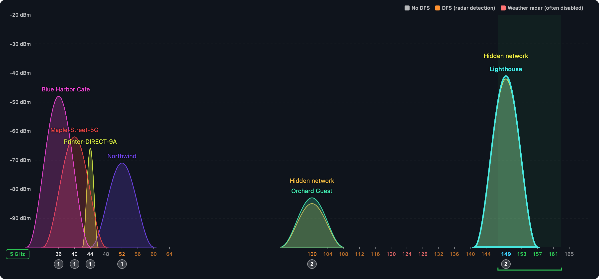
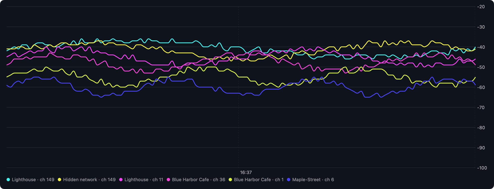
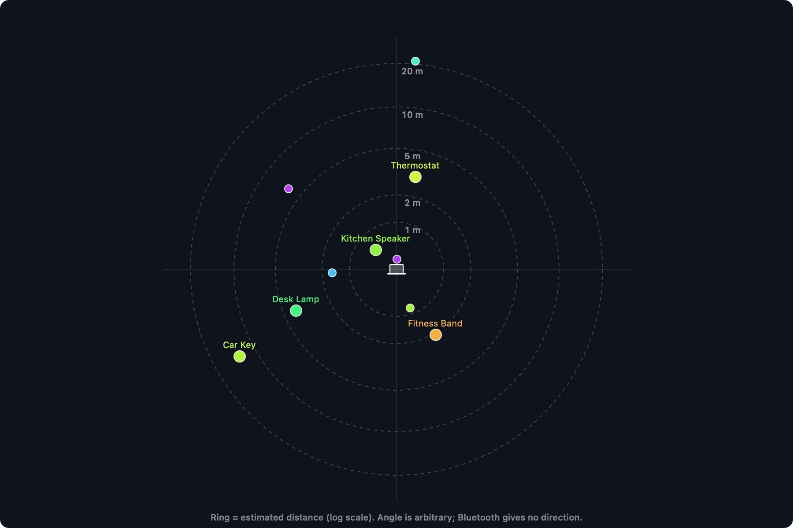

# Signal Analyzer

[](https://github.com/avrahamr/signal-analyzer/actions/workflows/ci.yml)
[](https://github.com/avrahamr/signal-analyzer/releases)
[](LICENSE)

Open-source macOS app for looking at the Wi-Fi and Bluetooth radio
environment around your Mac. MIT licensed.



<p align="center">
  
  
</p>

<sub>Screenshots use the built-in <code>--demo</code> data; the networks and devices are fictional.</sub>

## Download

- **Releases**: https://github.com/avrahamr/signal-analyzer/releases — tagged
  versions, plus a rolling **Nightly** pre-release built from every commit on
  `master`.
- Unzip and drag **Signal Analyzer.app** to Applications. Requires macOS 14
  or newer.

The app is signed ad hoc and **not notarised** (that needs a paid Apple
Developer account), so the first launch is blocked by Gatekeeper. Either open
System Settings → Privacy & Security and click **Open Anyway**, or clear the
quarantine flag once:

```bash
xattr -d com.apple.quarantine "/Applications/Signal Analyzer.app"
```

Grant Location access when asked; without it macOS hides network names.
Because the signature changes with every build, macOS may ask for Location
and Bluetooth permission again after updating.

Every pull request also produces a build as a workflow artifact (login
required, kept 30 days).

A macOS app that shows the radio environment around you: Wi-Fi networks with
live signal strength, a spectrum view of channel occupancy, RSSI history, a
deep-dive page per access point, and nearby Bluetooth LE devices.

## Tabs

- **Networks** — table sorted by signal. Click a row to open the detail
  inspector: signal/SNR/estimated distance with a history sparkline, radio
  (generation, standards, spatial streams, width, frequency), load
  (connected clients, channel utilisation) and roaming support (802.11k/v/r)
  decoded from the beacon's information elements, security details (cipher
  suites, authentication, management-frame protection, WPS), your own
  connection (PHY mode, link rate, IP, router, DNS) when connected, and an
  Advanced section with Join / Disconnect, copy, CSV export, raw IE dump and a
  shortcut to Apple's Wireless Diagnostics.
- **Charts** — *Spectrum*: analyzer-style view with one bell curve per
  network over the channels it occupies, peak = RSSI, coloured labels,
  per-channel occupancy badges, hover tooltips and a least-crowded-channel
  recommendation; switch band 2.4 / 5 / 6 GHz. *History*: RSSI over time for
  the strongest networks, same colours as the spectrum.
- **Bluetooth** — live Bluetooth LE advertisers. *Devices*: table with
  smoothed RSSI, manufacturer (from the SIG company ID), Apple Continuity type
  (AirPods, Find My, Handoff…), connectable flag, service count and last-seen.
  *History*: RSSI over time per device. *Radar*: devices as dots on
  estimated-distance rings around your Mac (angle is arbitrary; BLE gives no
  direction).

Settings (⌘,) control scan interval, hidden-network visibility, history
length, the distance model, and Bluetooth smoothing/expiry.

## How it works

| Layer | Choice | Why |
|-------|--------|-----|
| Scanning | **CoreWLAN** (`CWInterface.scanForNetworks`) | The only supported public API for nearby-network scans. The `airport` CLI was removed in macOS 14.4 and `wdutil` needs sudo. |
| Permission | **CoreLocation** (`requestWhenInUseAuthorization`) | Since macOS 14, CoreWLAN returns `nil` SSID/BSSID unless the app has Location access. |
| Beacon decoding | Own parser over `CWNetwork.informationElementData` | Exposes Wi-Fi generation, MIMO streams, BSS load, RSN ciphers and roaming flags that CoreWLAN does not surface. |
| Bluetooth | **CoreBluetooth** (`CBCentralManager.scanForPeripherals`) | LE advertisements carry RSSI; classic Bluetooth only reports RSSI once connected. |
| Charts | **Swift Charts** | Spectrum and history views with no third-party dependency. |
| UI | **SwiftUI** (`Table`) | Native look, minimal code, easy to extend with Swift Charts later. |
| Project | **XcodeGen** (`project.yml`) | The `.xcodeproj` is generated, so the repo has no merge-prone project file. |

Scans run on a background task (each one blocks for a few seconds while the
radio sweeps channels) and results are published to the main actor via
`ScanStore`.

## Requirements

- macOS 14 or newer (built and tested on macOS 26 / Xcode 26).
- Xcode with `xcode-select` pointing at it.
- [XcodeGen](https://github.com/yonaskolb/XcodeGen): `brew install xcodegen`.

## Build and run

```bash
make run        # generate project, build Debug, open the app
make open       # generate project and open it in Xcode
make test       # run unit tests
make clean
```

The first launch shows a banner asking for Location access. Click **Allow
Location Access** and approve the system prompt. Without it the app still
scans, but every network shows as "Hidden network" with no BSSID.

The app is signed ad hoc ("Sign to Run Locally"), so no Apple Developer
account is required. macOS may re-ask for Location permission after a
rebuild because the ad-hoc signature changes.

## Layout

```
project.yml                     XcodeGen spec (targets, Info.plist keys, signing)
Sources/WiFiSignal/
  WiFiSignalApp.swift           @main, window, menu commands, Settings scene
  ContentView.swift             TabView shell + shared toolbar
  AppSettings.swift             Persisted preferences
  SettingsView.swift            Preferences window
  Components.swift              SignalBars, InfoBanner, helpers
  WiFi/
    WiFiNetwork.swift           Value type, channel↔frequency maths, distance model
    InformationElements.swift   802.11 IE parser → NetworkCapabilities
    WiFiScanner.swift           CoreWLAN scan, interface status, join/disconnect
    ScanStore.swift             Main-actor state, history, presence, actions
    LocationPermission.swift    CoreLocation authorization state
    NetworksView.swift          Table + inspector + status bar
    NetworkDetailView.swift     Per-network detail page
    ChartsView.swift            Spectrum and history charts
    SpectrumAnalysis.swift      Channel lists, congestion scoring, stable colours
    SpectrumView.swift          Custom-drawn analyzer spectrum
  Bluetooth/
    BluetoothDevice.swift       Value type + company/Continuity decoding + distance
    BluetoothScanner.swift      CBCentralManager wrapper with RSSI history
    BluetoothView.swift         Devices / History / Radar modes
    BluetoothRadarView.swift    Proximity radar
Tests/WiFiSignalTests/          XCTest unit tests (parser, maths, decoding)
```

## Roadmap

Recommended next tasks, with reasoning and scope, live in
[ROADMAP.md](ROADMAP.md).

## Contributing

Issues and pull requests are welcome; see [CONTRIBUTING.md](CONTRIBUTING.md).
Every PR needs a green CI run and the maintainer's review. Planned work is in
[ROADMAP.md](ROADMAP.md).

## License

[MIT](LICENSE). Use it for anything.
